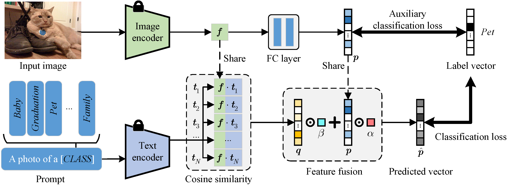

<div align="center">
<h1>TEG </h1>
<h3>TEG: image theme recognition using text-embedding-guided few-shot adaptation</h3>

Jikai Wang, [Wanglong Lu](https://longlongaaago.github.io/), Yu Wang, Kaijie Shi, Xianta Jiang, Hanli Zhao\*

Journal of Electronic Imaging ([https://doi.org/10.1117/1.JEI.33.1.013028](https://www.spiedigitallibrary.org/journals/journal-of-electronic-imaging/volume-33/issue-1/013028/TEG--image-theme-recognition-using-text-embedding-guided-few/10.1117/1.JEI.33.1.013028.short))

</div>

## Abstract
<div style="text-align: justify"> Grouping images into different themes is a challenging task in photo book curation. Unlike image object recognition, image theme recognition focuses on the understanding of the main subject or overall meaning conveyed by an image. However, it is challenging to achieve satisfactory performance using existing general image recognition methods. In this work, we aim to solve the image theme recognition task with few-shot training samples using pre-trained contrastive language-image models. A text-prompt-guided few-shot image adaptation framework is proposed, which incorporates a text-embedding-guided classifier and an auxiliary classification loss to exploit embedded visual and text features, stabilize the network training, and enhance recognition performance. We also present an annotated dataset Theme25 for studying image theme recognition. We conducted experiments on our Theme25 dataset as well as the publicly available CIFAR100 and ImageNet datasets to demonstrate the superiority of our method over the compared state-of-the-art methods. </div>

<p align="center">
  
</p>

**1. Main Environments.** </br>
The environment installation procedure can follow the steps below (python=3.10):</br>
```
git clone https://github.com/YasuoFly/ThemeRecognition.git
cd ThemeRecognition
conda create -n teg python=3.10
conda activate teg
pip install -r requirements.txt
```

**2. Datasets.** </br>
Theme25 Dataset can be downloaded from the link: [Theme25](https://drive.google.com/file/d/1B3CD4iv4PJEuiB16_stwfroz5TtH0W1F/view?usp=drive_link)

<p align="center">
  
</p>

**3. Train the TEG.**
```
python main.py --data_path /path/to/Theme25 --shot 1 --seed 1
```
- After training, you could obtain the log file in './log/' and the checkpoint file in './checkpoint/'

## Citation
If you find this repository helpful, please consider citing: </br>
```
@article{wang2024teg,
author = {Jikai Wang and Wanglong Lu and Yu Wang and Kaijie Shi and Xianta Jiang and Hanli Zhao},
title = {{TEG: image theme recognition using text-embedding-guided few-shot adaptation}},
journal = {Journal of Electronic Imaging},
year = {2024},
}
```

